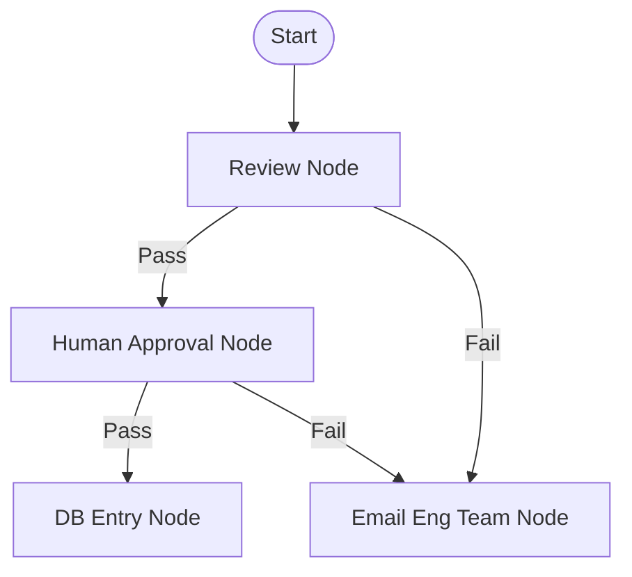

# Day 19: The Easiest Video On LangGraph | Free AI Engineer Course

> **Lecturer:** Pratyush  
> **Source:** [YouTube Video](https://youtu.be/VlvVpDZuykA)  
> **Course:** Free AI Engineer Course (8 Weeks)

---

## 1. Introduction and Learning Framework.

### 1.1 Context & Community Demand

* LangGraph is the most frequently requested topic across the AI Engineer course comments.
* Students often ask when LangGraph will be taught before even understanding basic LLM fundamentals.
* Many YouTube playlists contain 100 to 200 overly complex lectures on LangGraph, making it appear unnecessarily intimidating and deep.
* In reality, LangGraph is a simple, logical, and straightforward concept when stripped of unnecessary jargon and complex mathematics.

### 1.2 The Three-Part Learning Framework

* Any technology should be learned using a three-step framework:
  1. **WHAT** it is (क्या है)
  2. **WHY** it is used (क्यों है)
  3. **HOW** to use it (कैसे यूज़ करते हैं)

* This lecture covers **WHAT** LangGraph is and **WHY** it is needed. The next lecture will cover **HOW** to code and implement it.

---

## 2. Recapping a Simple AI Agent

### 2.1 Baseline AI Agent Architecture

* **Formula:**
  $$\text{AI Agent} = \text{Core LLM} + \text{Access to Functions / APIs (Tools)}$$
* In previous lectures, a simple AI Agent was built manually in pure Python without frameworks:
  * Two custom Python functions (tools) were written: a **Calculator** function and a **Web Search** function.
  * Tool schemas were passed to the LLM (Groq).
  * The LLM dynamically evaluated user queries (e.g., routing `"Who is Pratyush Narayan?"` to Web Search and `"10 * 21"` to Calculator), executed the selected tool, and returned the final answer.

---

## 3. The Scaling Problem: Why Custom Code Fails in Production

### 3.1 Production Complexity & Interdependent Workflows

* A simple 2-tool agent works cleanly in custom Python code.
* However, production systems in real enterprise environments (e.g., hardware manufacturing at Nvidia) do not consist of 2 simple tools.
* Production environments involve 20+ specialized tools with multi-step, highly interdependent branching workflows.

### 3.2 Real-World Example: Nvidia Automated Hardware Parts Purchasing Agent

* **Problem Statement:** Automate the hardware purchasing pipeline (e.g., buying RAM, 3D printers, machines) requested by engineering teams.
* **Multi-Step Tool Chain Required:**
  1. **Review Tool:** Analyzes if the engineering request (e.g., a 3D printer) is genuinely necessary or if work can proceed without it. Can send automated emails or calls asking for justification.
  2. **Human Approval Tool:** Sends a formal request/email to a human manager for approval.
  3. **Database Update Tool:** Logs approved purchase requests into the internal company database.
  4. **Vendor Request Tool:** Transmits the purchase order to external shopkeepers/vendors.
  5. **Payment Tool:** Triggers bank payment transfer from Nvidia's account to the vendor.
  6. **Delivery Tool:** Tracks final order dispatch and fulfillment.

### 3.3 Interdependency, Failures, and Branching Logic

Tools cannot run independently; each tool's execution depends on the exact outcome of prior tools:

* **Review Step:**
  * If Review passes $\rightarrow$ Go to Human Approval.
  * If Review fails $\rightarrow$ Escalate or notify engineering team.
* **Human Approval Step:**
  * If Manager approves $\rightarrow$ Update Database.
  * If Manager rejects $\rightarrow$ Notify engineering team. (The team might submit additional justification, requiring a retry loop back to Human Approval).
* **Database Step:**
  * If DB update succeeds $\rightarrow$ Request Vendor.
  * If DB update fails $\rightarrow$ Trigger error handling.
* **Vendor Step:**
  * If Vendor accepts $\rightarrow$ Trigger Payment.
  * If Vendor is out of stock $\rightarrow$ Handle failure or switch vendors.
* **Payment Step:**
  * If Payment passes $\rightarrow$ Trigger Delivery.
  * If Payment fails (e.g., bank error or insufficient funds) $\rightarrow$ Execute failure recovery.

### 3.4 The Spaghetti `if-else` Nightmare

* Writing this multi-branching, retry-heavy logic manually in pure Python produces an extremely ugly, unmaintainable mess of nested `if-else` blocks.
* If an order fails in production, diagnosing *why* or *where* it failed (Did the database fail? Did the manager reject? Did payment drop?) becomes nearly impossible to trace in custom spaghetti code.

---

## 4. What is LangGraph?

### 4.1 Definition and Role

* **LangGraph** is a **Management Service** or **Orchestrator** for complex agentic AI systems.
* It abstracts away messy `if-else` branching logic, structured output parsing errors, and complex state tracking, providing a clean, structured framework to build multi-agent workflows.

---

## 5. The Three Core Pillars of LangGraph

LangGraph solves complex workflow management by structuring the system around three primary components:

### 5.1 Pillar 1: State (The Shared Whiteboard)

* **Concept:** State acts as a large, **Shared Whiteboard** accessible to all tools and LLM nodes in the system.
* **Analogy:** In an office with 5 developers (Frontend, Backend, Database, Payment Gateway, UI Design) working on a project, a manager needs to know the overall status. Each developer writes their status on a central shared whiteboard (e.g., "Backend: Ready", "Payment: Ready", "Database: Error").
* **Function in LangGraph:** State holds the central data structure (messages, tool outputs, approval statuses, error logs) updated continuously as execution moves from node to node.

### 5.2 Pillar 2: Nodes (The Workers / Actions)

* **Concept:** A **Node** is any individual function, tool, or LLM call that performs actual work (equivalent to Vertices in Graph Theory).
* **Examples of Nodes:** `Call LLM` function, `Review Request` function, `Human Approval` function, `Update Database` function, `Make Payment` function.

### 5.3 Pillar 3: Edges (The Connections / Routing Rules)

* **Concept:** **Edges** are the directional connections between Nodes that define the execution flow and routing rules based on node outputs.
* **Function in LangGraph:** Edges specify where execution moves next (e.g., "If `Review Node` outputs `Pass` $\rightarrow$ Route along Edge to `Human Approval Node`"; "If `Review Node` outputs `Fail` $\rightarrow$ Route along Edge to `Email Engineering Team Node`").



```text
[Start] ──> (Review Node) ──[Pass]──> (Human Approval Node) ──[Pass]──> (DB Entry Node)
                 │                               │
              [Fail]                           [Fail]
                 │                               │
                 └──> (Email Eng Team Node) <────┘
```

---

## 6. Why It Is Called "LangGraph"

* It represents an agentic system as an explicit **Graph** composed of Nodes (actions) and Edges (transitions) running from Start to Finish.
* If a step fails in production (e.g., Human Approval drops), you can visually or programmatically isolate the exact failing Node in the graph rather than searching through thousands of lines of `if-else` code.

---

## 7. Why Manual Coding Was Taught First

* Developers must understand how to write base AI agents manually in pure Python before relying on orchestration frameworks.
* LangGraph is not a separate technology or replacement for coding; it is an orchestration library used to manage complex agentic architectures cleanly.

---

## ⚡ Quick Revision Summary

1. LangGraph is one of the most requested topics in AI engineering but is often overcomplicated by massive 100+ lecture playlists.
2. Learning any technical concept follows 3 steps: What it is, Why it is used, and How to use it.
3. An AI Agent consists of a core LLM combined with external tools/APIs (`AI Agent = Core LLM + Tools`).
4. Simple agents with 2 tools (e.g., Calculator + Web Search) are easy to write in pure Python.
5. Production systems require 20+ tools with interdependent, multi-step branching logic (e.g., Nvidia hardware purchasing pipeline).
6. Production purchasing workflows involve sequential steps: Review $\rightarrow$ Human Approval $\rightarrow$ DB Update $\rightarrow$ Vendor Order $\rightarrow$ Payment $\rightarrow$ Delivery.
7. Writing complex multi-step tool dependencies in pure Python results in unmaintainable, messy `if-else` code.
8. LangGraph acts as an Orchestrator or Management Service that simplifies complex agentic workflows.
9. LangGraph's 3 core pillars are State, Nodes, and Edges.
10. **State** represents a shared whiteboard holding system data and execution memory updated across all nodes.
11. **Nodes** represent individual tools, actions, or LLM calls that execute work (e.g., `Payment Node`, `Review Node`).
12. **Edges** represent the routing connections between nodes that decide execution paths based on outputs.
13. LangGraph gets its name because it models an entire agent system as an explicit directed Graph.
14. Graph representation allows instant isolation of failing nodes during production debugging.
15. Building base agents manually in Python first is essential before using LangGraph for multi-agent management.

---

## ❓ Questions Raised by Lecturer (if any)

> **Q:** Why didn't we use LangGraph from the very beginning when building our first 2-tool calculator and search agent?  
> **A:** Because developers must first know how to write base AI agents manually in pure Python. You should not be dependent on a framework to build basic agents; LangGraph is introduced later to handle complex, multi-tool orchestration.

---

## ⚠️ Important Points Lecturer Emphasised

* **LangGraph is Simple:** Do not be intimidated by 100-200 lecture YouTube playlists; LangGraph is a simple, logical management framework.
* **Spaghetti Code Avoidance:** Never write complex 20-tool enterprise workflows using manual nested `if-else` statements.
* **LangGraph is an Orchestrator:** LangGraph is not a separate magic technology or new programming language; it is a management framework/library for structuring agent systems.

---

## 🔗 Connections Lecturer Made

* Connected **LangGraph State** to a large shared whiteboard in an office where 5 specialized developers (Frontend, Backend, DB, Payment, Design) write their status updates for the project manager.
* Connected **LangGraph Nodes and Edges** to Graph Theory concepts (Vertices and Directed Edges).
* Connected complex tool branching to a real-world enterprise purchasing pipeline at Nvidia.

---

## 📖 Definitions (from Video Only)

* **LangGraph:** A management and orchestration framework/library that provides a structured method to build and control complex AI agent systems using graphs.
* **State:** A shared data structure (like a shared whiteboard) in LangGraph that stores system memory, message logs, and current status across all executing nodes.
* **Node:** An individual worker function, tool, or LLM call within a LangGraph workflow that performs a specific action.
* **Edge:** A directional connection between two nodes in LangGraph that defines routing and conditional execution flow based on node outputs.

---

## 💡 Examples Used in Video

* **Nvidia Automated Parts Purchasing Agent:** An AI agent system designed to automate hardware purchasing (RAM, 3D printers, machines) requested by engineering teams.
  * **Interdependent Tool Steps:**
    * *Review Tool:* Checks if a requested 3D printer is genuinely required.
    * *Human Approval Tool:* Sends an email to a human manager for sign-off.
    * *Database Tool:* Logs approved requests into company records.
    * *Vendor Tool:* Places the order with an external vendor.
    * *Payment Tool:* Transfers funds from Nvidia's bank account to the vendor.
* **Office Whiteboard Analogy:** 5 developers updating a central whiteboard so a manager can inspect system status.

---

## 💻 Code Written in Video (if any)

* *No code was written in this conceptual lecture.* (Syntax functions like `add_node()` and `add_edge()` were mentioned conceptually for the next hands-on coding lecture).