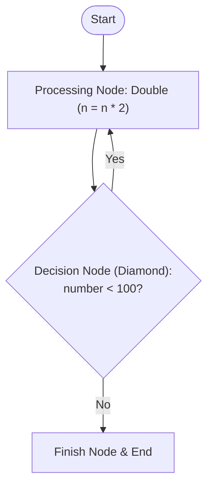

# Day 20: LangGraph Implementation | AI Engineer Course

> **Topic:** 18 | LangGraph Implementation | AI Engineer Course  
> **Lecturer:** Pratyush  
> **Source:** [YouTube Video](https://youtu.be/ZvYU7OlLAAE)  
> **Course:** Free AI Engineer Course (8 Weeks)

---

## 1. Introduction & Concept of LangGraph Implementation

### 1.1 "Hello World" of LangGraph

* This session focuses on the practical coding implementation ("Hello World") of LangGraph.
* No AI or LLM models are used in this lesson — the goal is purely to teach the coding mechanics of LangGraph.
* **LangGraph is NOT Rocket Science:** LangGraph is simply a Python framework designed to simplify complex conditional logic and multi-step workflows.
* Anything done with LangGraph can technically be built without it; LangGraph just eliminates messy nested `if-else` loops (e.g. reducing 200 lines of spaghetti code into a clean structure).

---

## 2. Problem Statement: The Number Doubling DSA Example

### 2.1 Problem Logic

* To demonstrate LangGraph without LLM complexity, a simple Data Structures and Algorithms (DSA) problem is used.
* **Rules:**
  * **Input:** An integer `n` (e.g., `5`).
  * **Condition:** If `n < 100`, continuously double `n` (`n = n * 2`).
  * **Exit Condition:** As soon as `n >= 100`, stop doubling and print the final number.
* **Example Sequence for Input `5`:**
  * `5` $\rightarrow$ `10` $\rightarrow$ `20` $\rightarrow$ `40` $\rightarrow$ `80` $\rightarrow$ `160` (Stops at `160` because $160 \ge 100$).

### 2.2 Flow Chart Representation

* Maps directly to school/college CS Flow Charts:
  * **Start Node:** Initial entry point.
  * **Processing Node:** Doubles the number.
  * **Decision Node (Diamond):** Checks if `number < 100`.
    * If **Yes**: Loop back to Processing Node (Double).
    * If **No**: Proceed to Finish Node and End.
* LangGraph acts as the code implementation of this exact flow chart logic.



---

## 3. The Three Core Components of LangGraph in Code

### 3.1 Component 1: State (`TypedDict`)

* **Concept:** Represents the shared whiteboard storing data that changes during execution.
* **Implementation:** Defined as a Python class inheriting from `TypedDict` (from `typing`).
* **Office Analogy:** A shared whiteboard in an office where 5 engineers (Backend, Frontend, DB, Payment, Login) write updates (e.g., "DB Ready", "Payment Error") so everyone and the manager can inspect overall progress.
* **Data Key:** For the doubling problem, the state contains a single key `number` of type `int`.
* **Constraint:** Nodes can only update keys explicitly defined in the `State` class. Returning undefined keys in a node dictionary is invalid.

### 3.2 Component 2: Nodes (Python Functions)

* **Concept:** Workers/Functions that directly read and modify data on the State (whiteboard).
* **Function Requirements:**
  1. Accepts `state` (State object/dict) as an input argument.
  2. Returns a Python dictionary (`dict`) containing updated key-value pairs for the state.
* **Node vs. General Helper Functions:**
  * Functions that directly modify state data and return dictionaries are **Nodes**.
  * Functions that perform background tasks without modifying state (e.g., the office tea server/chai-maker) or functions that return routing strings (decision functions) are **General Helper Functions**, NOT nodes.
* **Defined Nodes:**
  * `double(state)`: Reads `number`, doubles it (`new_number = board_num * 2`), prints status, and returns `{"number": new_number}`.
  * `finish(state)`: Reads `number`, prints final number, and returns `{"number": board_num}` (state unchanged).

### 3.3 Component 3: Edges (`add_edge` and `add_conditional_edges`)

* **Concept:** Connections/Lines that define execution flow between nodes.
* **Direct Edge (`add_edge`):** Unconditional routing from one node to another (e.g., routing `finish` directly to `END`).
* **Conditional Edge (`add_conditional_edges`):** Routing decided dynamically based on the output of a decision helper function.
* **Decision Function (`decision`):** Reads `state["number"]`. Returns string `"double"` if `number < 100`, otherwise returns string `"finish"`.

---

## 4. Code Implementation Walkthrough

### 4.1 Step-by-Step Code Construction

1. Import `TypedDict` from `typing`.
2. Import `StateGraph` and `END` from `langgraph.graph`.
3. Define `State` class inheriting from `TypedDict`.
4. Write `double` and `finish` node functions returning dictionaries.
5. Write `decision` helper function returning routing strings.
6. Instantiate `StateGraph(State)`.
7. Add nodes via `builder.add_node()`.
8. Set entry point via `builder.set_entry_point("double")`.
9. Add conditional edges via `builder.add_conditional_edges("double", decision, {"double": "double", "finish": "finish"})`.
10. Add final direct edge via `builder.add_edge("finish", END)`.
11. Compile via `builder.compile()`.
12. Invoke via `graph.invoke({"number": 5})`.

### 4.2 Complete Implementation Code

```python
from typing import TypedDict
from langgraph.graph import StateGraph, END

# 1. Define State (Shared Whiteboard)
class State(TypedDict):
    number: int

# 2. Define Nodes (Worker Functions)
def double(state: State) -> dict:
    board_num = state["number"]
    new_number = board_num * 2
    print(f"In double: {new_number}")
    return {"number": new_number}

def finish(state: State) -> dict:
    board_num = state["number"]
    print(f"In finish: {board_num}")
    return {"number": board_num}

# 3. Define Helper Function for Conditional Routing (NOT a Node)
def decision(state: State) -> str:
    if state["number"] < 100:
        return "double"
    else:
        return "finish"

# 4. Build and Assemble the Graph
builder = StateGraph(State)

# Add Nodes
builder.add_node("double", double)
builder.add_node("finish", finish)

# Set Entry Point
builder.set_entry_point("double")

# Add Conditional Edges
builder.add_conditional_edges(
    "double",       # Source Node
    decision,       # Decision/Router Function
    {               # Mapping dictionary: decision return value -> Target Node Name
        "double": "double",
        "finish": "finish"
    }
)

# Add Direct Edge to END
builder.add_edge("finish", END)

# Compile Graph
graph = builder.compile()

# 5. Invoke Graph
if __name__ == "__main__":
    result = graph.invoke({"number": 5})
    print("Final Result:", result)
```

### 4.3 Lecturer's Key Explanations

* **`add_conditional_edges` Syntax:** Takes 3 arguments: Source Node string (`"double"`), Decision Function reference (`decision`), and a Mapping Dictionary (`{"decision_string": "target_node_name"}`).
* **Graph State Updates:** Whenever a node returns a dict like `{"number": new_number}`, LangGraph automatically intercepts it and updates the corresponding key on the shared State whiteboard.
* **Node Identifiers:** In `add_node("node_name", function)`, the first string argument is the identifier used by LangGraph. All `set_entry_point` and edge references must use this string name.

---

## ⚡ Quick Revision Summary

1. LangGraph implementation can be learned using simple non-AI Python/DSA code without needing LLM APIs.
2. LangGraph is a framework that simplifies complex branching logic and replaces nested `if-else` loops.
3. LangGraph directly converts traditional CS Flow Charts into executable Python code.
4. The 3 core pillars of LangGraph in code are State, Nodes, and Edges.
5. State is defined using `TypedDict` and acts as a shared whiteboard storing data updated throughout graph execution.
6. Nodes are Python functions that accept `state` and return a `dict` containing state updates.
7. Nodes can only update keys explicitly declared in the `TypedDict` State class.
8. Helper functions that return strings/booleans for routing (like `decision`) are not nodes because they do not return state update dictionaries.
9. `builder.add_node("name", func)` adds a worker node to the graph layout.
10. `builder.set_entry_point("name")` sets the starting node of the flow chart graph.
11. `builder.add_conditional_edges()` routes execution dynamically based on a decision function's return value.
12. `builder.add_edge("finish", END)` routes a node directly to the graph's termination point.
13. `builder.compile()` builds the executable graph object.
14. `graph.invoke({"number": 5})` initializes the state whiteboard and starts execution from the entry point.
15. Running code locally using `uv add langgraph` is recommended over Google Colab due to Colab environment bugs.

---

## ❓ Questions Raised by Lecturer (if any)

> **Q:** Is it mandatory to use LangGraph to solve AI engineering problems?  
> **A:** No. Anything built with LangGraph can technically be built without it; LangGraph is simply a framework that makes complex conditional flows cleaner and easier to manage.

> **Q:** Is every function in a LangGraph Python file considered a Node?  
> **A:** No. Only functions that accept `state` and return a state-updating dictionary (`dict`) are Nodes. Decision/routing functions or background utilities (like tea servers in an office) are general helper functions, NOT nodes.

---

## ⚠️ Important Points Lecturer Emphasised

* **Node Return Type Rule:** A node function MUST return a `dict`. Returning non-dict types prevents LangGraph from updating the state whiteboard.
* **State Schema Rule:** A node can ONLY update keys defined in the `TypedDict` State class. Trying to return undefined keys will result in errors.
* **Correct Method Name (`add_conditional_edges`):** Note the plural `edges` in `add_conditional_edges`.
* **String Node Identifiers:** Always reference node string names (e.g. `"double"`), not Python function references, when setting entry points or defining edge mapping dictionaries.

---

## 🔗 Connections Lecturer Made

* Connected LangGraph implementation to a student's first "Hello World" program in C++ or Python.
* Connected LangGraph structure to Class 9/10 CS Flow Charts (Start circle, Processing box, Diamond decision node, Exit).
* Connected non-node helper functions to an office tea server (chai-maker) who performs work but does not write project updates on the shared engineering whiteboard.

---

## 📖 Definitions (from Video Only)

* **LangGraph State (`TypedDict`):** A shared data structure acting as a central whiteboard where all active nodes read and update global system data.
* **Node:** A Python function in LangGraph that receives `state` and returns a dictionary of updated key-value pairs for the shared state.
* **Direct Edge (`add_edge`):** An unconditional connection between two nodes in a LangGraph workflow.
* **Conditional Edge (`add_conditional_edges`):** A dynamic connection that routes execution to different nodes based on the output string of a router/decision function.
* **Entry Point:** The designated starting node where graph execution begins when `graph.invoke()` is called.
* **`END`:** A special constant in LangGraph representing graph execution termination.

---

## 💡 Examples Used in Video

* **Office Whiteboard Analogy:** 5 engineers (Backend, Frontend, DB, Payment, Login) writing updates ("DB Ready", "Payment Error") on a central whiteboard for the manager.
* **Chai-Maker Analogy:** An office worker who serves tea (performs work) but does not write updates on the engineering whiteboard (non-node helper function).
* **Number Doubling Sequence:** Input `5` $\rightarrow$ `10` $\rightarrow$ `20` $\rightarrow$ `40` $\rightarrow$ `80` $\rightarrow$ `160` (stops at 160 because $160 \ge 100$).

---

## 💻 Code Written in Video (if any)

* **LangGraph Number Doubling Script:** Demonstrates defining a `TypedDict` State, writing `double` and `finish` node functions, writing a `decision` router helper function, initializing `StateGraph`, adding nodes with `add_node()`, setting entry point with `set_entry_point()`, adding conditional routing with `add_conditional_edges()`, linking termination with `add_edge("finish", END)`, compiling with `builder.compile()`, and executing via `graph.invoke({"number": 5})`.